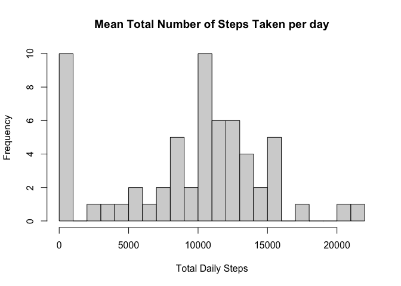
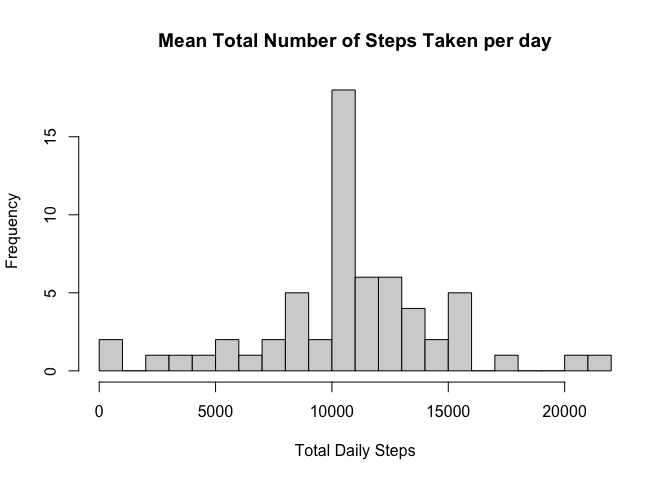
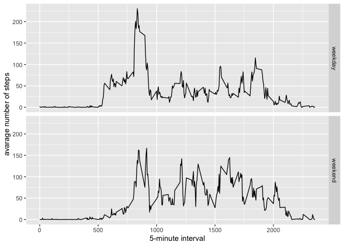

## Loading and preprocessing the data

```r
data<-read.csv("/Users/macintosh/Downloads/activity.csv",header=T)
```

## What is mean total number of steps taken per day?
### 1. Total number of steps taken per day

```r
data1<-tapply(data$steps,data$date,sum,na.rm=T)
```
### 2. Histogram of total number of steps per day

```r
hist(data1,xlab="Total Daily Steps",main="Mean Total Number of Steps Taken per day",breaks=20)
```

<!-- -->

### 3. Mean and median number of steps taken each day

```r
meandata<-mean(data1)
mediandata<-median(data1)
```
* Mean: 9354.2295082 
* Median: 10395

## What is the average daily activity pattern?
### 1. Time series plot of the average number of steps taken

```r
library(ggplot2)
data2 <- aggregate(x=list(steps=data$steps),by=list(interval=data$interval),FUN=mean,na.rm=T)
ggplot(data2,aes(x=interval,y=steps))+geom_line()+
  xlab("5-minute interval")+ylab("average number of steps taken")
```

<!-- -->

### 2. The 5-minute interval that, on average, contains the maximum number of steps

```r
moststeps<-data2[which.max(data2$interval),]
```
* Most Steps at: 2355, 1.0754717

## Imputing missing values
### 1. Total number of missing data

```r
missingdata<-length(which(is.na(data$steps)))
```
* Most Steps at: 2304

### 2. Code to describe and show a strategy for imputing missing data

```r
fill<-function(steps,interval){
  filled<-NA
  if(!is.na(steps))
    filled<-c(steps)
  else
    filled <- (data2[data2$interval==interval, "steps"])
  return(filled)}
filldata<-data
filldata$steps<-mapply(fill,filldata$steps,filldata$interval)
```

### 3. Histogram of the total number of steps taken each day after missing values are imputed

```r
data3<-tapply(filldata$steps,filldata$date,FUN=sum)
hist(data3,xlab="Total Daily Steps",main="Mean Total Number of Steps Taken per day",breaks=20)
```

<!-- -->

### 4. Mean and median number of steps taken each day

```r
imputemean<-mean(data3)
imputemedian<-median(data3)
```
* Mean: 1.0766189\times 10^{4} 
* Median: 1.0766189\times 10^{4}

## Are there differences in activity patterns between weekdays and weekends?
### Panel plot comparing the average number of steps taken per 5-minute interval across weekdays and weekends

```r
library(ggplot2)
filldata$datetype<-ifelse(as.POSIXlt(filldata$date)$wday %in% c(0,6),"weekend","weekday")
data4 <- aggregate(steps~interval + datetype,data=filldata,mean)
ggplot(data4,aes(interval,steps))+geom_line()+facet_grid(datetype ~ .)+
  xlab("5-minute interval") + ylab("avarage number of steps")
```

<!-- -->
